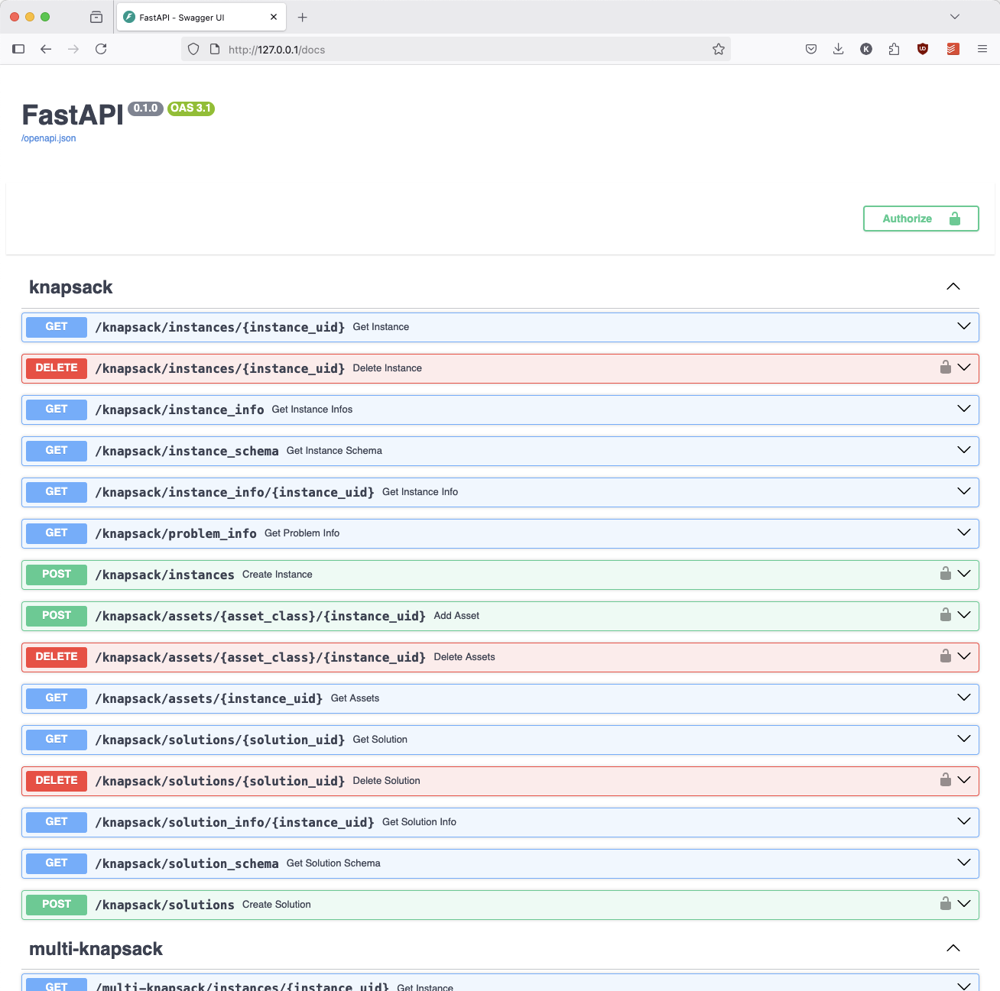

# Instance Repository Backend

This project provides a simple, maintainable endpoint for serving benchmark
instances (and optionally solutions). It was designed with two main goals:

1. **Simplicity**: The instance repository is built upon a straightforward file
   structure that can be easily cloned from a Git repository or an FTP server.
   It should be trivial to create a local archive or host it independently, in
   case we ever discontinue the public server.
2. **Extensibility**: Adding a new problem class should require minimal effort.
   Ideally, you can simply copy an existing configuration file and adapt it to
   the new problem class without modifying any code.

## Features

The instance repository backend offers several key features to manage and
interact with benchmark instances:

- **Instance and Solution Management**: Easily upload, download, and delete
  instances and solutions.
- **Filtering and Sorting**: Filter instances by numerical or boolean
  attributes, and sort them by specific fields.
- **Asset Management**: Upload and download assets (e.g., images or thumbnails)
  associated with each instance.

While this repository provides the backend, the user interface is expected to be
served by a separate frontend (not included here). All necessary endpoints and
metadata are exposed, allowing you to build a simple JavaScript frontend that
can be hosted on a static web server. By dynamically exposing query parameters,
the backend helps keep the frontend in sync and facilitates reuse across
different problem classes.

Because research institutes often have changing teams, this system is designed
to be easy to maintain and extend—even for newcomers with minimal web
development experience. Should the institute discontinue the public server,
anyone can simply clone the repository and host the system independently with
minimal effort.

## Limitations

While this project aims to be lightweight, maintainable, and easily extensible,
it comes with a few important limitations:

- **Security**: It uses only basic access control via a single access key,
  making it unsuitable for scenarios where external users need to upload their
  own instances or solutions.
- **Scalability**: Designed primarily for read-only use with occasional updates,
  the system may struggle under heavy write loads or frequent modifications.
- **Performance**: The server is not optimized for high-traffic or large-scale
  deployments. It works best for small to medium-sized repositories within
  research institutes or small communities rather than large public platforms
  like Kaggle.
- **Flexibility**: Because the system relies on Pydantic and follows certain
  conventions (e.g., instance and solution UIDs), you may need to adapt your
  data or code if you plan to host repositories that deviate significantly from
  these models.

## Configuring a New Problem Class

A configuration for a problem class consists of schemas for instance and
solution files, as well as various endpoint attributes. Configurations are
written as simple Python files, using **Pydantic v2**. We chose Pydantic for its
popularity, readability, and tight integration with FastAPI, which automatically
generates documented endpoints based on the schema definitions.

Below is an example configuration file for a knapsack problem:

```python
from pydantic import (
    BaseModel,
    Field,
    NonNegativeFloat,
    NonNegativeInt,
    PositiveFloat,
    PositiveInt,
)


class KnapsackInstance(BaseModel):
    """Pydantic model representing a knapsack problem instance."""

    # Metadata
    instance_uid: str = Field(..., description="The unique identifier of the instance")
    origin: str = Field(default="", description="The origin or source of the instance")

    # Instance statistics
    num_items: PositiveInt = Field(
        ..., description="The number of items available in the instance"
    )
    weight_capacity_ratio: PositiveFloat = Field(
        ...,
        description=(
            "The ratio of the total weight of all items to the knapsack capacity. "
            "Calculated as the sum of item weights divided by the knapsack capacity."
        ),
    )
    integral: bool = Field(
        default=False,
        description="Specifies if the capacity, values, and weights are integral.",
    )

    # Instance data
    capacity: NonNegativeFloat | NonNegativeInt = Field(
        ..., description="The total capacity of the knapsack"
    )
    item_values: list[NonNegativeFloat | NonNegativeInt] = Field(
        ..., description="The values assigned to each item"
    )
    item_weights: list[NonNegativeFloat | NonNegativeInt] = Field(
        ..., description="The weights assigned to each item"
    )
    # NOTE: For more complex instances, you can use a hierarchy of models.
    # Just specify the root model below in the INSTANCE_SCHEMA variable.


class KnapsackSolution(BaseModel):
    """Pydantic model representing a solution to a knapsack problem instance."""

    # Solution metadata
    instance_uid: str = Field(
        ..., description="The unique identifier of the corresponding instance"
    )
    objective: NonNegativeFloat = Field(
        ..., description="The objective value of the solution (e.g., total value)"
    )
    authors: str = Field(..., description="The authors or contributors of the solution")

    # Solution data
    selected_items: list[int] = Field(
        ..., description="Indices of the selected items in the solution"
    )


# Configuration constants for the knapsack problem

# Unique identifier for the problem
PROBLEM_UID = "knapsack"

# Shared attribute name for instances and solutions
INSTANCE_UID_ATTRIBUTE = "instance_uid"

# Schema definitions
INSTANCE_SCHEMA = KnapsackInstance
SOLUTION_SCHEMA = KnapsackSolution  # Set to None if solutions are not supported

# Filtering and sorting configurations
RANGE_FILTERS = [
    "num_items",
    "weight_capacity_ratio",
]  # Fields usable for range filters
BOOLEAN_FILTERS = ["integral"]  # Boolean fields usable for filters
SORT_FIELDS = ["num_items", "weight_capacity_ratio"]  # Fields usable for sorting

# Fields for display in instance overviews
DISPLAY_FIELDS = [
    "instance_uid",
    "num_items",
    "weight_capacity_ratio",
    "integral",
    "origin",
]

# Assets associated with the knapsack problem
ASSETS = {"thumbnail": "png", "image": "png"}

# Solution-specific configurations
SOLUTION_SORT_ATTRIBUTES = [
    "objective"
]  # Fields for sorting solutions; a "-" prefix indicates descending order.
SOLUTION_DISPLAY_FIELDS = ["objective", "authors"]  # Fields to display for solutions
```

## Getting Started

You can start the instance repository backend using Docker:

```bash
docker compose up --build
```

Once the containers are running, open the Swagger UI at
[http://127.0.0.1/docs](http://127.0.0.1/docs) to explore and interact with the
API.

You can also directly browse the repository at
[http://127.0.0.1/static/](http://127.0.0.1/static/). Adapt the
`docker-compose.yml` file to fit your requirements, especially regarding access
keys.

To test the setup, both example problems in this repository include a
`generate.py` script that generates random instances.

## Project Structure

The project is organized as follows:

- **`server/`**: Contains the FastAPI server implementation. You generally do
  **not** need to modify this directory.
- **`REPOSITORY/`**: Contains configuration files and data for the instance
  repository. This directory is mapped directly into the server, so you can
  maintain it via a separate Git repository if desired.
- **`.dockerignore`**: Lists files to ignore when building the Docker image.
- **`.gitignore`**: Lists files to ignore when committing to the Git repository.
- **`.pre-commit-config.yaml`**: Configuration for pre-commit hooks, helping to
  maintain code quality.
- **`docker-compose.yml`**: Defines the Docker services. You will likely need to
  edit this for your specific use case (e.g., environment variables, access
  keys, domain).
- **`Dockerfile`**: Builds the FastAPI server.
- **`entrypoint.py`**: Entrypoint script for the Docker container. It indexes
  all instances and solutions on startup before running the FastAPI server.
- **`LICENSE`**: MIT License.
- **`nginx.conf`**: Configuration for the Nginx server. Edit as needed,
  especially if you plan to enable HTTPS.
- **`README.md`**: This file.
- **`requirements.txt`**: Python requirements for the FastAPI server.

## Setting Up Your Own Instance Repository

1. **Clone this repository**.
2. **Adapt the `REPOSITORY/` directory** to your needs. You can base your work
   on one of the example problem configurations and remove the ones you don’t
   need.
3. **Adjust `docker-compose.yml`** to suit your setup. By default, it’s
   configured for local use only. In particular, update the `environment`
   section:
   - Change the access key to a secure value. This project provides only a very
     basic access key mechanism.
   - Change the URL to your domain if you plan to deploy publicly.
4. **Update `nginx.conf`**. This file is crucial for configuring HTTPS. If you
   only need read-only access and don’t mind using HTTP, you can theoretically
   skip HTTPS—but note that sending an access key over HTTP is insecure.
5. **Start the server** by running:

   ```bash
   docker compose up --build
   ```

## If the Index Gets Corrupted

If the index becomes corrupted, you can reset the database. Upon startup, the
system automatically rebuilds the index from the repository:

1. Identify the database volume with:
   ```bash
   docker volume list
   ```
2. Remove the volume with:
   ```bash
   docker volume rm VOLUME_NAME
   ```
3. If necessary, remove the PostgreSQL container first:
   ```bash
   docker container list
   docker container rm CONTAINER_NAME
   ```

After removing the corrupted volume, restart the services to rebuild the index.

> [!WARNING]
>
> You may want to deactivate that mechanism if you build a huge repository, as
> otherwise you could experience long startup times after restarts. We decided
> to implement this feature as a default to make it super easy to repair, in
> case something gets broken because you were to lazy to check the code of your
> student assistant properly (none of us have the time and students make
> mistakes...).

## Routes

The backend exposes several routes for managing instances and solutions.

- `GET /{PROBLEM_UID}/instances/{INSTANCE_UID}`: Retrieve a specific instance
  for a problem by its UID.
- `GET /{PROBLEM_UID}/instance_info`: Query instance metadata with pagination
  and filtering support.
- `GET /{PROBLEM_UID}/instance_schema`: Return the JSON schema of the instance
  model.
- `GET /{PROBLEM_UID}/instance_info/{INSTANCE_UID}`: Retrieve metadata for a
  specific instance.
- `GET /{PROBLEM_UID}/problem_info`: Retrieve metadata about the problem,
  including filters and asset information.
- `POST /{PROBLEM_UID}/instances/`: Create a new instance and index it for
  querying. This is protected by an API-Key, which needs to be provided in the
  request header as `api-key`.
- `DELETE /{PROBLEM_UID}/instances/{INSTANCE_UID}`: Delete a specific instance
  by its UID. This is protected by an API-Key, which needs to be provided in the
  request header as `api-key`.

### Assets

Instances can have associated assets (e.g., images or thumbnails). The backend
provides endpoints to manage these (optional) assets. Note that the assets will
be served by the nginx server, and these endpoints are just for managing the
assets or getting the asset paths.

- `POST /{PROBLEM_UID}/assets/{ASSET_CLASS}/{INSTANCE_UID}`: Upload an asset
  (e.g., image or thumbnail) for a specific instance. This is protected by an
  API-Key, which needs to be provided in the request.
- `GET /{PROBLEM_UID}/assets/{INSTANCE_UID}`: Retrieve all assets associated
  with a specific instance. The response includes the asset classes and their
  corresponding file paths.
- `DELETE /{PROBLEM_UID}/assets/{ASSET_CLASS}/{INSTANCE_UID}`: Delete a specific
  asset for an instance. This is protected by an API-Key, which needs to be
  provided in the request.

### Solutions (Optional)

If solutions are configured for a problem class, the backend provides endpoints
to manage solutions.

- `GET /{PROBLEM_UID}/solutions/{SOLUTION_UID}`: Retrieve a specific solution by
  its UID.
- `GET /{PROBLEM_UID}/solution_info/{INSTANCE_UID}`: Retrieve paginated solution
  metadata for a specific instance.
- `GET /{PROBLEM_UID}/solution_schema`: Retrieve the JSON schema of the solution
  model.
- `POST /{PROBLEM_UID}/solutions`: Enter a new solution for a specific instance.
  The solution must reference a valid instance UID. This is protected by an
  API-Key, which needs to be provided in the request header as `api-key`.
- `DELETE /{PROBLEM_UID}/solutions/{SOLUTION_UID}`: Delete a specific solution
  by its UID. This operation also removes the solution from the index. This is
  protected by an API-Key, which needs to be provided in the request header as
  `api-key`.

## Rules for UIDs

Unique identifiers (UIDs) are essential for maintaining consistency and avoiding
conflicts across the repository, ensuring smooth operation and data integrity.

- **Problem UIDs**: Must be unique across the entire repository. They can
  contain alphanumeric characters, underscores, and hyphens. E.g., it can be
  `knapsack`, `tsp`, or `my_problem_class`. Slashes are not allowed in problem
  UIDs because the repository organizes problems in a flat structure, ensuring
  simplicity and avoiding hierarchical complexities that could arise from nested
  paths.
- **Instance UIDs**: Must be unique within a problem class, but can be reused
  across different problem classes. They are allowed to contain alphanumeric
  characters, underscores, hyphens, and slashes. E.g., it can be
  `my_instance_1`, `my_instance-2`, or `my/instance/3`. The slash can be used to
  create a hierarchy, e.g., using the benchmark name as a prefix
  (`tsplib/a280`). Instance UIDs are not allowed to start or end with a slash.
- **Solution UIDs**: Will be automatically generated by the backend.

## Swagger UI

You can explore the API using the Swagger UI at
[http://127.0.0.1/docs](http://127.0.0.1/docs) using the example configuration.



## Example API Usage

Here is an example of how to use the API to upload a new instance and retrieve
it:

```python
import requests


class Connector:
    def __init__(self, base_url: str, problem_uid: str, api_key: str | None = None):
        self.base_url = base_url
        self.problem_uid = problem_uid
        self.api_key = api_key

    def get_instance_schema(self):
        """Returns the schema for problem instances."""
        response = requests.get(f"{self.base_url}/{self.problem_uid}/instance_schema")
        response.raise_for_status()
        return response.json()

    def get_instance(self, instance_uid: str):
        """Fetches a specific problem instance by its UID."""
        response = requests.get(
            f"{self.base_url}/{self.problem_uid}/instances/{instance_uid}"
        )
        response.raise_for_status()
        return response.json()

    def get_all_instance_info(
        self, offset: int = 0, limit: int = 100, params: dict | None = None
    ):
        """Fetches all problem instances."""
        if params is None:
            params = {}
        response = requests.get(
            f"{self.base_url}/{self.problem_uid}/instance_info",
            params={"offset": offset, "limit": limit}.update(params),
        )
        response.raise_for_status()
        return response.json()

    def get_instance_info(self, instance_uid: str):
        """Fetches information about a specific problem instance."""
        response = requests.get(
            f"{self.base_url}/{self.problem_uid}/instance_info/{instance_uid}"
        )
        response.raise_for_status()
        return response.json()

    def get_problem_info(self):
        """Fetches information about the problem."""
        response = requests.get(f"{self.base_url}/{self.problem_uid}/problem_info/")
        response.raise_for_status()
        return response.json()

    def upload_instance(self, instance: BaseModel):
        """Uploads a new problem instance."""
        headers = {}
        if self.api_key:
            headers["api-key"] = self.api_key

        response = requests.post(
            f"{self.base_url}/{self.problem_uid}/instances",
            json=instance.model_dump(mode="json"),
            headers=headers,
        )
        response.raise_for_status()
        return response.json()

    def delete_instance(self, instance_uid: str):
        """Deletes a problem instance by its UID."""
        headers = {}
        if self.api_key:
            headers["api-key"] = self.api_key

        response = requests.delete(
            f"{self.base_url}/{self.problem_uid}/instances/{instance_uid}",
            headers=headers,
        )
        response.raise_for_status()
        return response.json()

    # assets
    def get_assets(self, instance_uid: str):
        """Fetches all assets for a problem instance."""
        response = requests.get(
            f"{self.base_url}/{self.problem_uid}/assets/{instance_uid}"
        )
        response.raise_for_status()
        return response.json()

    def upload_asset(self, instance_uid: str, asset_class: str, asset_path: str):
        """Uploads an asset for a problem instance."""
        headers = {}
        if self.api_key:
            headers["api-key"] = self.api_key

        # Read the file data from the provided path
        with open(asset_path, "rb") as f:
            files = {"file": f}

            response = requests.post(
                f"{self.base_url}/{self.problem_uid}/assets/{asset_class}/{instance_uid}",
                files=files,
                headers=headers,
            )
            print(response.text)

        response.raise_for_status()
        return response.json()

    def delete_asset(self, instance_uid: str, asset_class: str):
        """Deletes a specific asset for a problem instance."""
        headers = {}
        if self.api_key:
            headers["api-key"] = self.api_key

        response = requests.delete(
            f"{self.base_url}/{self.problem_uid}/assets/{asset_class}/{instance_uid}",
            headers=headers,
        )
        response.raise_for_status()
        return response.json()

    # solutions
    def get_solution_schema(self):
        """Returns the schema for problem solutions."""
        response = requests.get(f"{self.base_url}/{self.problem_uid}/solution_schema")
        response.raise_for_status()
        return response.json()

    def get_solution_info(self, instance_uid: str, offset: int = 0, limit: int = 100):
        """Fetches the solutions for a specific problem instance."""
        response = requests.get(
            f"{self.base_url}/{self.problem_uid}/solution_info/{instance_uid}",
            params={"offset": offset, "limit": limit},
        )
        response.raise_for_status()
        return response.json()

    def upload_solution(self, solution: BaseModel):
        """Uploads a new solution for a problem instance."""
        headers = {}
        if self.api_key:
            headers["api-key"] = self.api_key

        response = requests.post(
            f"{self.base_url}/{self.problem_uid}/solutions",
            json=solution.model_dump(mode="json"),
            headers=headers,
        )
        response.raise_for_status()
        return response.json()

    def get_solution(self, solution_uid: str):
        """Fetches a specific solution by its UID."""
        response = requests.get(
            f"{self.base_url}/{self.problem_uid}/solutions/{solution_uid}"
        )
        response.raise_for_status()
        return response.json()

    def delete_solution(self, solution_uid: str):
        """Deletes a specific solution for a problem instance."""
        headers = {}
        if self.api_key:
            headers["api-key"] = self.api_key

        response = requests.delete(
            f"{self.base_url}/{self.problem_uid}/solutions/{solution_uid}",
            headers=headers,
        )
        response.raise_for_status()
        return response.json()


# For the local example configuration
connector = Connector(
    base_url="http://127.0.0.1", problem_uid=PROBLEM_UID, api_key="3456345-456-456"
)
```

## Changelog

- 2025-05-26: Changed some parameters to follow some conventions, e.g.,
  `api_key` became `api-key` in the request header.
